# ESP32 FREERTOS
## 打印ESP32任务
1. menuconfig中，打开FreeRTOS的trace打印功能
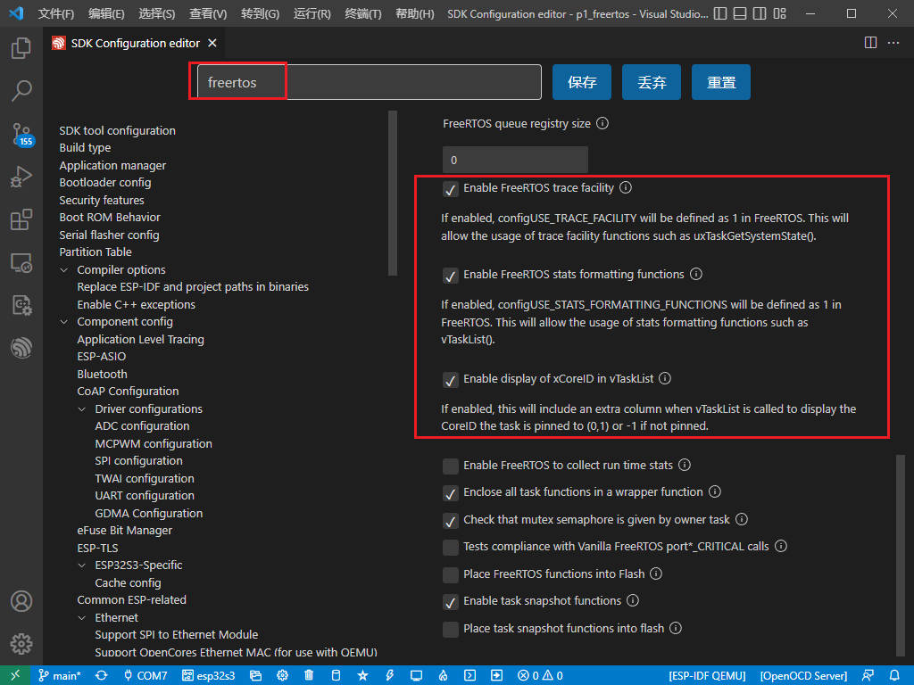
2. menuconfig中，增加app_main主任务的栈大小

3. 测试代码
**ESP32最小工程**
```c
#include <stdio.h>
#include "freertos/FreeRTOS.h"
#include "freertos/task.h"

static void print_task(void)
{
    char buffer[512] = {0};

    printf("%s\t\t%s\t%s\t%s\t%s\t%s\n", "任务名", "状态", "优先级", "堆栈", "序号", "CPU");
    vTaskList(buffer);
    printf("%s", buffer);
}

void app_main(void)
{
    print_task();
}
```
4. 运行结果
**ESP32最小工程的任务：**  
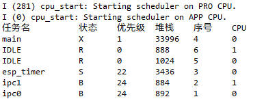  
5. WIFI扫描工程  
在WIFI扫描功能最后打印FreeRTOS任务
```c
#include <stdio.h>
#include <string.h>
#include "freertos/FreeRTOS.h"
#include "freertos/task.h"
#include "esp_log.h"
#include "nvs.h"
#include "nvs_flash.h"
#include "esp_wifi.h"
#include "esp_event.h"

#define MAX_SCAN_NUM    20

const char *TAG = "WIFI";

void print_task(void)
{
    char buffer[512] = {0};

    printf("%s\t\t%s\t%s\t%s\t%s\t%s\n", "任务名", "状态", "优先级", "堆栈", "序号", "CPU");
    vTaskList(buffer);
    printf("%s", buffer);
}

void app_main(void)
{
    ESP_LOGI(TAG, "0. 初始化NVS存储");
    nvs_flash_init();

    ESP_LOGI(TAG, "1. WiFi初始化阶段");
    esp_netif_init();
    esp_event_loop_create_default();
    esp_netif_create_default_wifi_sta();
    wifi_init_config_t wifi_config = WIFI_INIT_CONFIG_DEFAULT();
    esp_wifi_init(&wifi_config);

    ESP_LOGI(TAG, "2. WiFi配置阶段");
    esp_wifi_set_mode(WIFI_MODE_STA);
    

    ESP_LOGI(TAG, "3. WiFi启动阶段");
    esp_wifi_start();

    ESP_LOGI(TAG, "4. WiFi扫描阶段");
    wifi_country_t ccode_config = {
        .cc = "CN",
        .schan = 1,
        .nchan = 13,
        .policy = WIFI_COUNTRY_POLICY_AUTO,
    };
    printf("WiFi scan start...\n");
    esp_wifi_set_country(&ccode_config);
    esp_wifi_scan_start(NULL, true);

    uint16_t ap_count = 0;
    esp_wifi_scan_get_ap_num(&ap_count);
    uint16_t number = MAX_SCAN_NUM;
    wifi_ap_record_t ap_records[MAX_SCAN_NUM];
    memset(ap_records, 0x00, sizeof(ap_records));
    esp_wifi_scan_get_ap_records(&number, ap_records);
        printf("%-5s %-30s %-10s %-5s %-5s\n", "seq", "ssid", "channel", "rssi", "mac");
    for (int i = 0; i < number; i++) {
        printf("%-5d %-30s %-10d %-5d %02x:%02x:%02x:%02x:%02x:%02x\n", i, ap_records[i].ssid, ap_records[i].primary, ap_records[i].rssi,
            ap_records[i].bssid[0], ap_records[i].bssid[1], ap_records[i].bssid[2], ap_records[i].bssid[3], ap_records[i].bssid[4], ap_records[i].bssid[5]);
    }
    printf("WiFi scan done!\n");

    print_task();
}
```  
执行结果：  
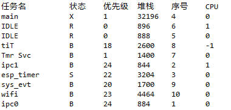  
### 文档和代码的对应关系  
1. 任务对应
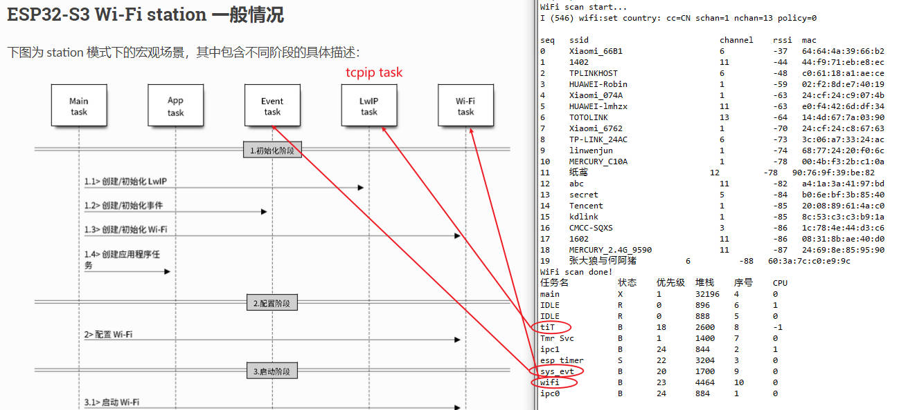
2. 时序对应
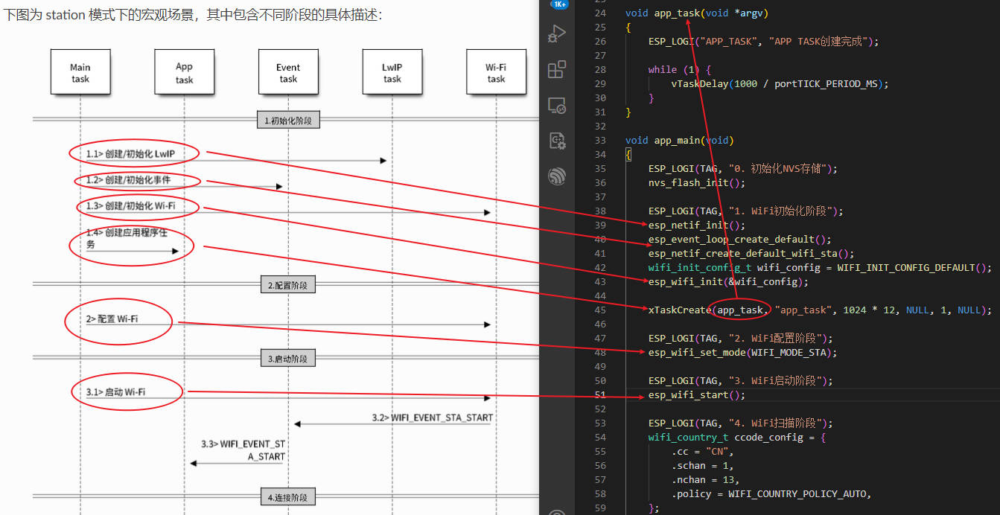
### ESP32 EventLoop
[EventLoop官方文档链接](https://docs.espressif.com/projects/esp-idf/zh_CN/v4.4.3/esp32s3/api-reference/system/esp_event.html)  
1. 常用的API  
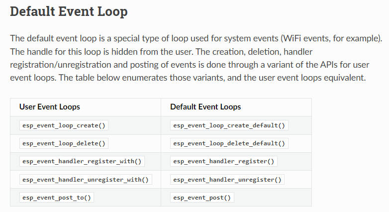  
2. 官方文档中给出了参考示例  
```c
// 1. Define the event handler
void run_on_event(void* handler_arg, esp_event_base_t base, int32_t id, void* event_data)
{
    // Event handler logic
}
```
3. 使用`esp_event_handler_register()`函数，来执行WIFI扫描。这里有两个特别值得注意的宏定义：  
esp_event_base.h
```c
typedef const char*  esp_event_base_t; /**< unique pointer to a subsystem that exposes events */

// Defines for registering/unregistering event handlers
#define ESP_EVENT_ANY_BASE     NULL             /**< register handler for any event base */
#define ESP_EVENT_ANY_ID       -1               /**< register handler for any event id */
```
测试代码中打印了EVENT事件base和id
```c
#include <stdio.h>
#include <string.h>
#include "freertos/FreeRTOS.h"
#include "freertos/task.h"
#include "esp_log.h"
#include "nvs.h"
#include "nvs_flash.h"
#include "esp_wifi.h"
#include "esp_event.h"

#define MAX_SCAN_NUM    20

void run_on_event(void* handler_arg, esp_event_base_t base, int32_t id, void* event_data)
{
    ESP_LOGE("EVENT_HANDLE", "base:%s id:%d", base, id);
}

void app_task(void *argv)
{
    ESP_LOGI("APP_TASK", "APP TASK创建完成");
    esp_event_handler_register(ESP_EVENT_ANY_BASE, ESP_EVENT_ANY_ID, run_on_event, NULL);

    while (1) {
        vTaskDelay(1000 / portTICK_PERIOD_MS);
    }
}

void app_main(void)
{
    ESP_LOGI("MAIN_TASK", "0. 初始化NVS存储");
    nvs_flash_init();

    ESP_LOGI("MAIN_TASK", "1. WiFi初始化阶段");
    esp_netif_init();
    esp_event_loop_create_default();
    esp_netif_create_default_wifi_sta();
    wifi_init_config_t wifi_config = WIFI_INIT_CONFIG_DEFAULT();
    esp_wifi_init(&wifi_config);

    xTaskCreate(app_task, "app_task", 1024 * 12, NULL, 1, NULL);

    ESP_LOGI("MAIN_TASK", "2. WiFi配置阶段");
    esp_wifi_set_mode(WIFI_MODE_STA);
    
    ESP_LOGI("MAIN_TASK", "3. WiFi启动阶段");
    esp_wifi_start();

    ESP_LOGI("MAIN_TASK", "4. WiFi扫描阶段");
    wifi_country_t ccode_config = {
        .cc = "CN",
        .schan = 1,
        .nchan = 13,
        .policy = WIFI_COUNTRY_POLICY_AUTO,
    };
    printf("WiFi scan start...\n");
    esp_wifi_set_country(&ccode_config);
    esp_wifi_scan_start(NULL, true);

    uint16_t ap_count = 0;
    esp_wifi_scan_get_ap_num(&ap_count);
    uint16_t number = MAX_SCAN_NUM;
    wifi_ap_record_t ap_records[MAX_SCAN_NUM];
    memset(ap_records, 0x00, sizeof(ap_records));
    esp_wifi_scan_get_ap_records(&number, ap_records);
        printf("%-5s %-30s %-10s %-5s %-5s\n", "seq", "ssid", "channel", "rssi", "mac");
    for (int i = 0; i < number; i++) {
        printf("%-5d %-30s %-10d %-5d %02x:%02x:%02x:%02x:%02x:%02x\n", i, ap_records[i].ssid, ap_records[i].primary, ap_records[i].rssi,
            ap_records[i].bssid[0], ap_records[i].bssid[1], ap_records[i].bssid[2], ap_records[i].bssid[3], ap_records[i].bssid[4], ap_records[i].bssid[5]);
    }
    printf("WiFi scan done!\n");

    vTaskDelete(NULL);
}
```
打印事件的base和id。可以看到<font color="red">图中红字部分</font>打印的base为字符串WIFI_EVENT，id分别为2和1。  
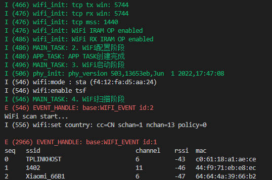  
**<font color="red">这里的字符串WIFI_EVENT和ID=2 ID:1表示什么意思?</font>**  
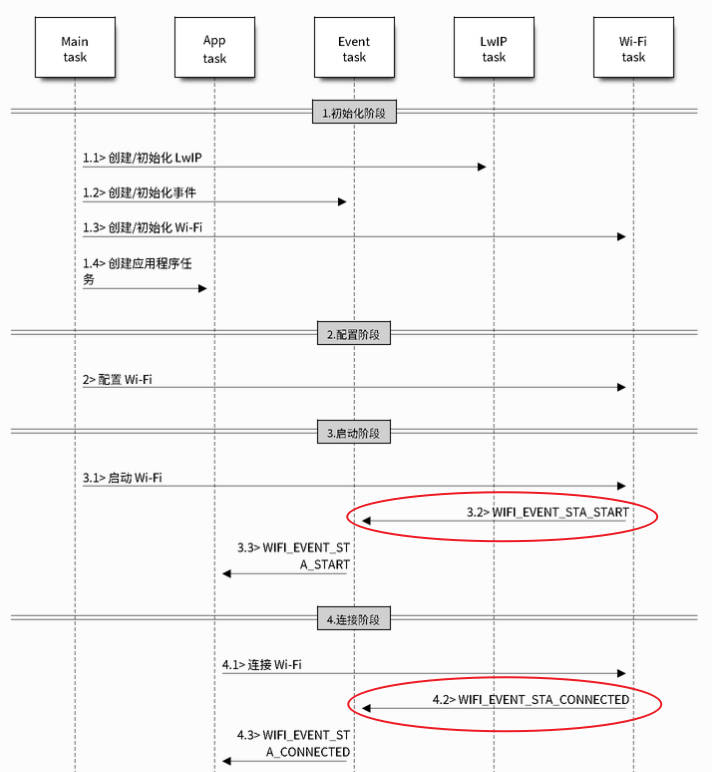  
参考官方给出的启动过程，打印WiFi启动阶段后，打印了ID:2，猜测ID:2应该是WIFI_EVENT_STA_START；而在打印了WiFi scan start后，打印了ID:1，猜测ID:1应该是完成扫描。  
<font color="red">我们的猜测对不对？要看官方文档</font>  
3. 官方文档中的事件描述  
[官网事件描述链接](https://docs.espressif.com/projects/esp-idf/zh_CN/v4.4.3/esp32s3/api-guides/wifi.html?highlight=wifi_event_sta_start#wifi-event-sta-start)  
官网给出的WIFI事件  
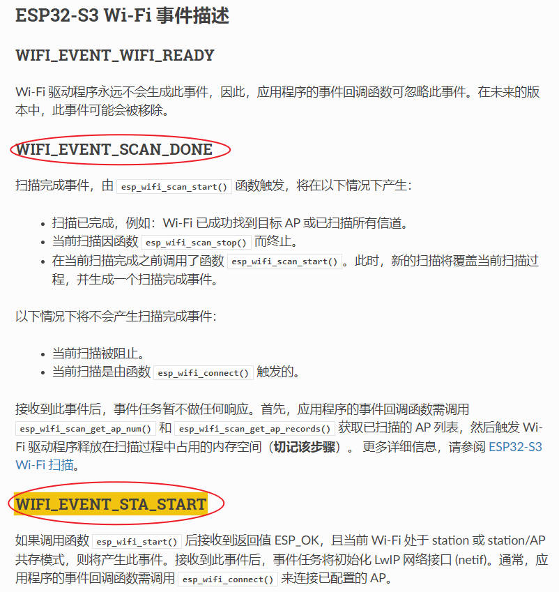  
对应的代码：`esp_wifi_types.h`
```c
/** WiFi event declarations */
typedef enum {
    WIFI_EVENT_WIFI_READY = 0,           /**< ESP32 WiFi ready */
    WIFI_EVENT_SCAN_DONE,                /**< ESP32 finish scanning AP */
    WIFI_EVENT_STA_START,                /**< ESP32 station start */
    WIFI_EVENT_STA_STOP,                 /**< ESP32 station stop */
    WIFI_EVENT_STA_CONNECTED,            /**< ESP32 station connected to AP */
    WIFI_EVENT_STA_DISCONNECTED,         /**< ESP32 station disconnected from AP */
    WIFI_EVENT_STA_AUTHMODE_CHANGE,      /**< the auth mode of AP connected by ESP32 station changed */

    WIFI_EVENT_STA_WPS_ER_SUCCESS,       /**< ESP32 station wps succeeds in enrollee mode */
    WIFI_EVENT_STA_WPS_ER_FAILED,        /**< ESP32 station wps fails in enrollee mode */
    WIFI_EVENT_STA_WPS_ER_TIMEOUT,       /**< ESP32 station wps timeout in enrollee mode */
    WIFI_EVENT_STA_WPS_ER_PIN,           /**< ESP32 station wps pin code in enrollee mode */
    WIFI_EVENT_STA_WPS_ER_PBC_OVERLAP,   /**< ESP32 station wps overlap in enrollee mode */

    WIFI_EVENT_AP_START,                 /**< ESP32 soft-AP start */
    WIFI_EVENT_AP_STOP,                  /**< ESP32 soft-AP stop */
    WIFI_EVENT_AP_STACONNECTED,          /**< a station connected to ESP32 soft-AP */
    WIFI_EVENT_AP_STADISCONNECTED,       /**< a station disconnected from ESP32 soft-AP */
    WIFI_EVENT_AP_PROBEREQRECVED,        /**< Receive probe request packet in soft-AP interface */

    WIFI_EVENT_FTM_REPORT,               /**< Receive report of FTM procedure */

    /* Add next events after this only */
    WIFI_EVENT_STA_BSS_RSSI_LOW,         /**< AP's RSSI crossed configured threshold */
    WIFI_EVENT_ACTION_TX_STATUS,         /**< Status indication of Action Tx operation */
    WIFI_EVENT_ROC_DONE,                 /**< Remain-on-Channel operation complete */

    WIFI_EVENT_STA_BEACON_TIMEOUT,       /**< ESP32 station beacon timeout */

    WIFI_EVENT_MAX,                      /**< Invalid WiFi event ID */
} wifi_event_t;
```
可以看到，与我们的之前的猜测一致。ID=2表示WIFI_EVENT_STA_START，ID=1表示WIFI_EVENT_SCAN_DONE。  
我们在event_handler中打印事件id，代码如下：
```c
void run_on_event(void* handler_arg, esp_event_base_t base, int32_t id, void* event_data)
{
    switch (id) {
        case WIFI_EVENT_SCAN_DONE:
            ESP_LOGE("EVENT_HANDLE", "WIFI_EVENT_SCAN_DONE");
            break;
        case WIFI_EVENT_STA_START:
            ESP_LOGE("EVENT_HANDLE", "WIFI_EVENT_STA_START");
            break;
        default:
            break;
    }
}
```
执行结果：  
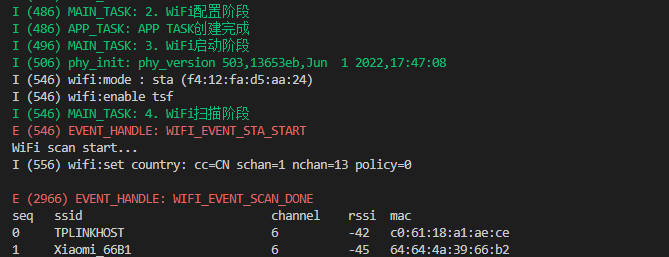  
4. 能不能在event_handler中，收到WIFI_EVENT_STA_START后执行WIFI扫描?  
测试代码：
```c
void wifi_scan(void)
{
    wifi_country_t ccode_config = {
        .cc = "CN",
        .schan = 1,
        .nchan = 13,
        .policy = WIFI_COUNTRY_POLICY_AUTO,
    };
    printf("WiFi scan start...\n");
    esp_wifi_set_country(&ccode_config);
    esp_wifi_scan_start(NULL, true);

    uint16_t ap_count = 0;
    esp_wifi_scan_get_ap_num(&ap_count);
    uint16_t number = MAX_SCAN_NUM;
    wifi_ap_record_t ap_records[MAX_SCAN_NUM];
    memset(ap_records, 0x00, sizeof(ap_records));
    esp_wifi_scan_get_ap_records(&number, ap_records);
    printf("Scan %d AP\n", ap_count);
    printf("%-5s %-30s %-10s %-5s %-5s\n", "seq", "ssid", "channel", "rssi", "mac");
    for (int i = 0; i < number; i++) {
        printf("%-5d %-30s %-10d %-5d %02x:%02x:%02x:%02x:%02x:%02x\n", i, ap_records[i].ssid, ap_records[i].primary, ap_records[i].rssi,
            ap_records[i].bssid[0], ap_records[i].bssid[1], ap_records[i].bssid[2], ap_records[i].bssid[3], ap_records[i].bssid[4], ap_records[i].bssid[5]);
    }
    printf("WiFi scan done!\n");
}

void run_on_event(void* handler_arg, esp_event_base_t base, int32_t id, void* event_data)
{
    switch (id) {
        case WIFI_EVENT_SCAN_DONE:
            ESP_LOGE("EVENT_HANDLE", "WIFI_EVENT_SCAN_DONE");
            break;
        case WIFI_EVENT_STA_START:
            ESP_LOGE("EVENT_HANDLE", "WIFI_EVENT_STA_START");
            wifi_scan();
            break;
        default:
            break;
    }
}
```
执行结果：可以看到，在收到WIFI_EVENT_STA_START执行wifi_scan，在sys_evt任务中产生了栈溢出。为什么?  
看下之前打印的任务堆栈，sys_ent只剩下1170字节，所以我们不能在event中处理比较复杂的工作。  
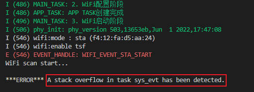  
sys_evt默认堆栈配置：
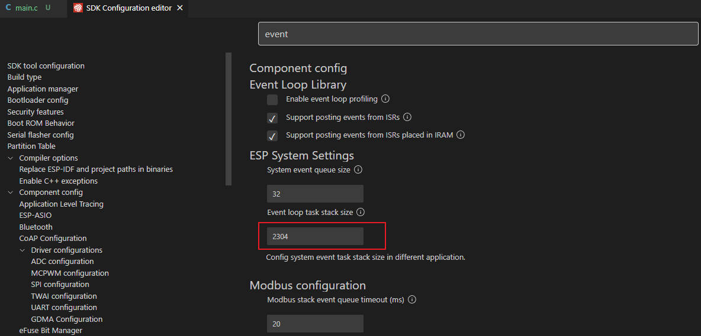  
5. EVENT转任务  
5.1  直接临时创建任务，执行完之后删除
```c
void wifi_scan_start(void)
{
    wifi_country_t ccode_config = {
        .cc = "CN",
        .schan = 1,
        .nchan = 13,
        .policy = WIFI_COUNTRY_POLICY_AUTO,
    };
    printf("WiFi scan start...\n");
    esp_wifi_set_country(&ccode_config);
    esp_wifi_scan_start(NULL, true);
}

void wifi_scan_result(void)
{
    uint16_t ap_count = 0;
    esp_wifi_scan_get_ap_num(&ap_count);
    uint16_t number = MAX_SCAN_NUM;
    wifi_ap_record_t ap_records[MAX_SCAN_NUM];
    memset(ap_records, 0x00, sizeof(ap_records));
    esp_wifi_scan_get_ap_records(&number, ap_records);
    printf("Scan %d AP\n", ap_count);
    printf("%-5s %-30s %-10s %-5s %-5s\n", "seq", "ssid", "channel", "rssi", "mac");
    for (int i = 0; i < number; i++) {
        printf("%-5d %-30s %-10d %-5d %02x:%02x:%02x:%02x:%02x:%02x\n", i, ap_records[i].ssid, ap_records[i].primary, ap_records[i].rssi,
            ap_records[i].bssid[0], ap_records[i].bssid[1], ap_records[i].bssid[2], ap_records[i].bssid[3], ap_records[i].bssid[4], ap_records[i].bssid[5]);
    }
    printf("WiFi scan done!\n");
}

void scan_start_task(void *argv)
{
    wifi_scan_start();
    vTaskDelete(NULL);
}

void scan_result_task(void *argv)
{
    wifi_scan_result();
    vTaskDelete(NULL);
}

void run_on_event(void* handler_arg, esp_event_base_t base, int32_t id, void* event_data)
{
    switch (id) {
        case WIFI_EVENT_SCAN_DONE:
            ESP_LOGE("EVENT_HANDLE", "WIFI_EVENT_SCAN_DONE");
            xTaskCreate(scan_result_task, "scan_result_task", 1024 * 12, NULL, 1, NULL);
            break;
        case WIFI_EVENT_STA_START:
            ESP_LOGE("EVENT_HANDLE", "WIFI_EVENT_STA_START");
            xTaskCreate(scan_start_task, "scan_start_task", 1024 * 12, NULL, 1, NULL);
            break;
        default:
            break;
    }
}
```
执行结果：  
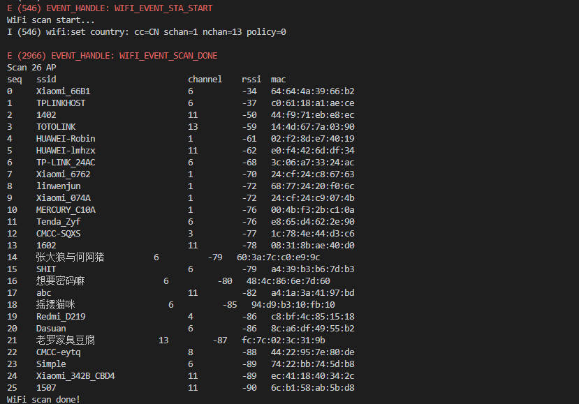
