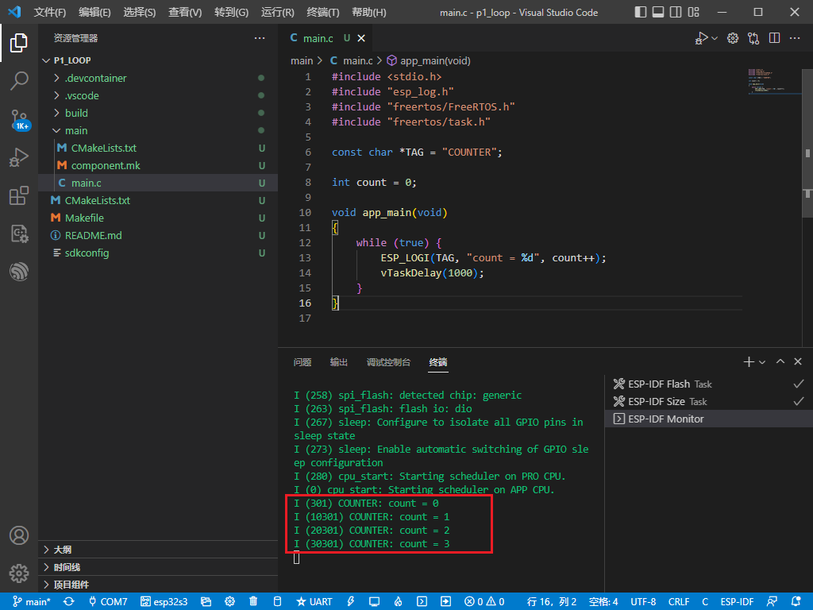
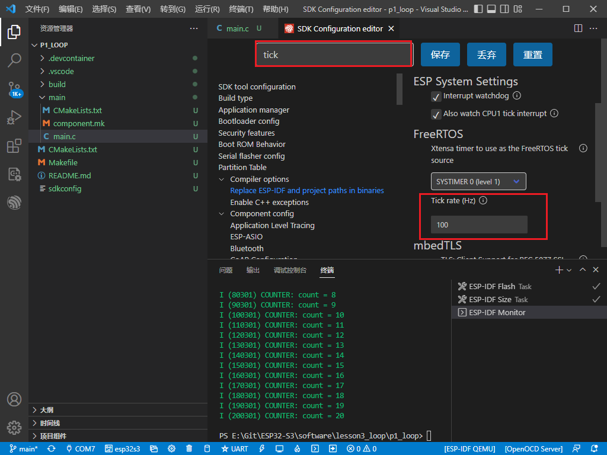
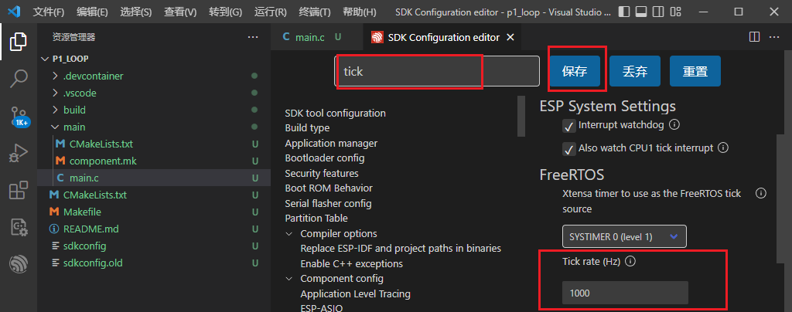
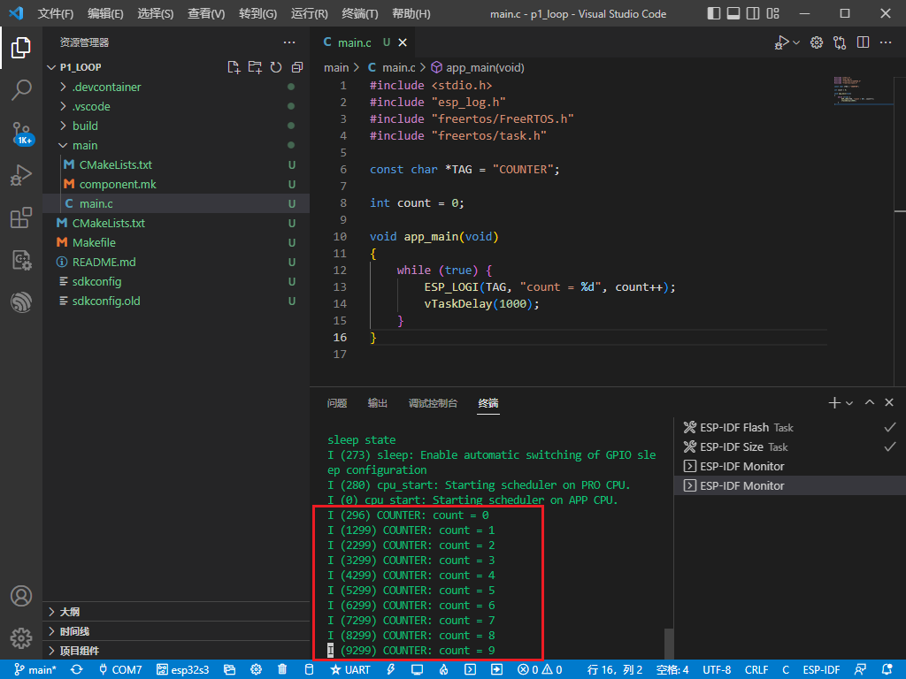
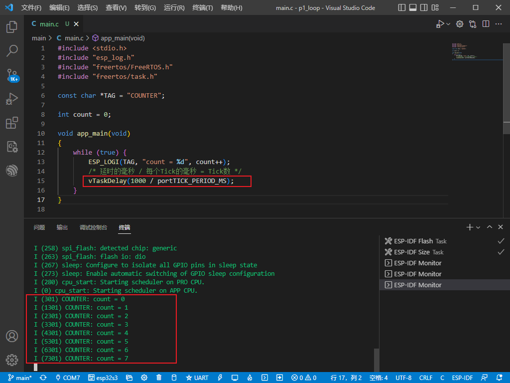

#ESP32 - 循环

###1 创建工程
```c
#include <stdio.h>
#include "esp_log.h"
#include "freertos/FreeRTOS.h"
#include "freertos/task.h"

const char *TAG = "COUNTER";

int count = 0;

void app_main(void)
{
    while (true) {
        ESP_LOGI(TAG, "count = %d", count++);
        vTaskDelay(1000);
    }
}
```
###2 编译运行
实际运行的循环周期为10秒

原因：vTaskDelay单位是Tick，难道ESP32的Tick != 10ms ?

###方法1：menuconfig配置Tick
打开menuconfig，输入tick，发现ESP32的Tick为100Hz，每次Tick周期10ms，那么vTaskDelay中的1000次Tick就是10秒

把Tick rate配置成1000Hz，再编译运行



###方法2：修改源代码
恢复默认的menuconfig，修改延时计算方式
```c
#include <stdio.h>
#include "esp_log.h"
#include "freertos/FreeRTOS.h"
#include "freertos/task.h"

const char *TAG = "COUNTER";

int count = 0;

void app_main(void)
{
    while (true) {
        ESP_LOGI(TAG, "count = %d", count++);
        /* 延时的毫秒 / 每个Tick的毫秒 = Tick数 */
        vTaskDelay(1000 / portTICK_PERIOD_MS);
    }
}
```
执行结果
