### NVS Blob块存储
#### 1. 演示app_main任务栈溢出
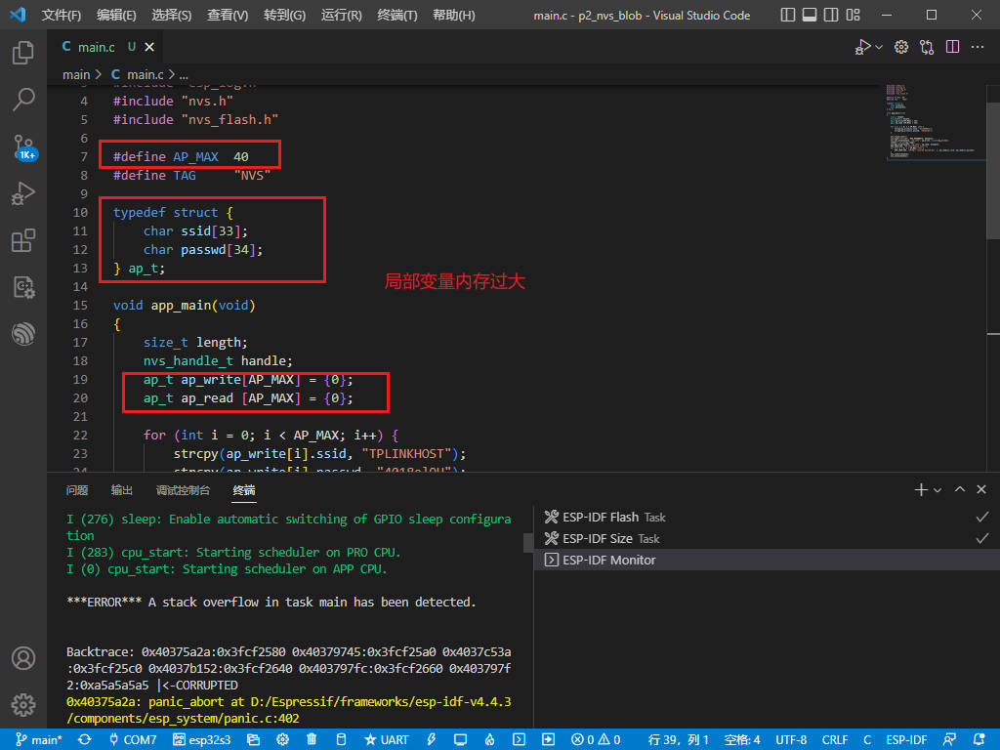
#### 2. 设置app_main任务栈大小
打开menuconfig，输入main，如下图所示
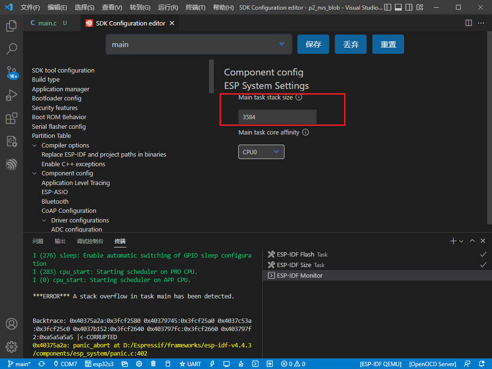
默认栈大小为3584字节，这里改为35840字节，重新编译
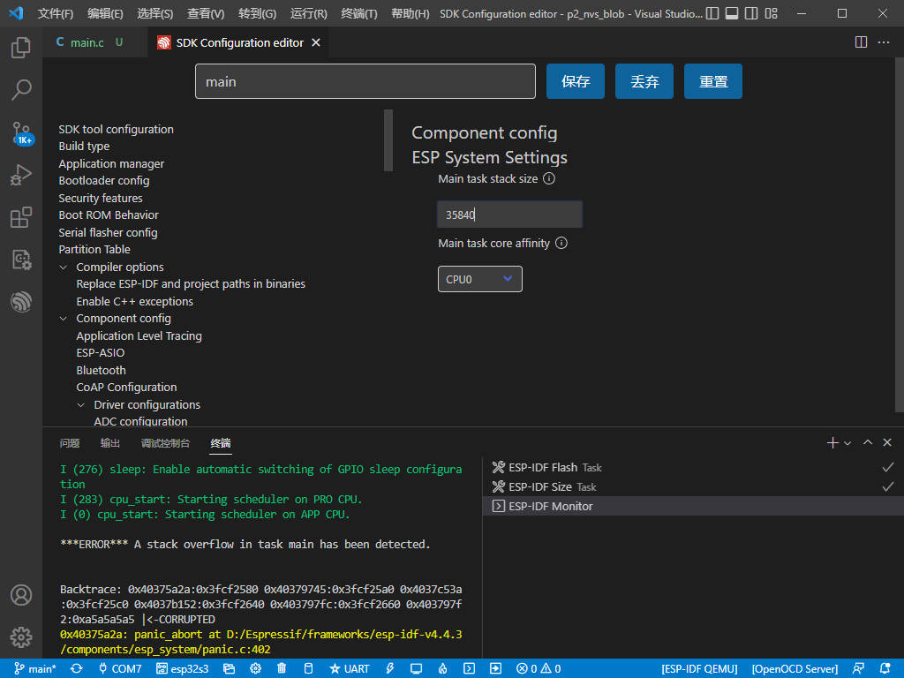
#### 3. Blob存储结果
```c
#include <stdio.h>
#include <string.h>
#include "esp_log.h"
#include "nvs.h"
#include "nvs_flash.h"

#define AP_MAX  40
#define TAG     "NVS"

typedef struct {
    char ssid[33];
    char passwd[34];
} ap_t;

void app_main(void)
{
    size_t length;
    nvs_handle_t handle;
    ap_t ap_write[AP_MAX] = {0};
    ap_t ap_read [AP_MAX] = {0};

    for (int i = 0; i < AP_MAX; i++) {
        strcpy(ap_write[i].ssid, "TPLINKHOST");
        strcpy(ap_write[i].passwd, "4018el9U");
    }

    nvs_flash_init();
    nvs_open("storage", NVS_READWRITE, &handle);
    nvs_set_blob(handle, "ap_info", ap_write, sizeof(ap_write));
    length = sizeof(ap_read);
    nvs_get_blob(handle, "ap_info", ap_read, &length);
    ESP_LOGI(TAG, "AP information list:");
    for (int i = 0; i < AP_MAX; i++) {
        ESP_LOGI(TAG, "AP(%d): ssid:%s passwd:%s", i, ap_read[i].ssid, ap_read[i].passwd);
    }
    nvs_commit(handle);
    nvs_close(handle);
}
```
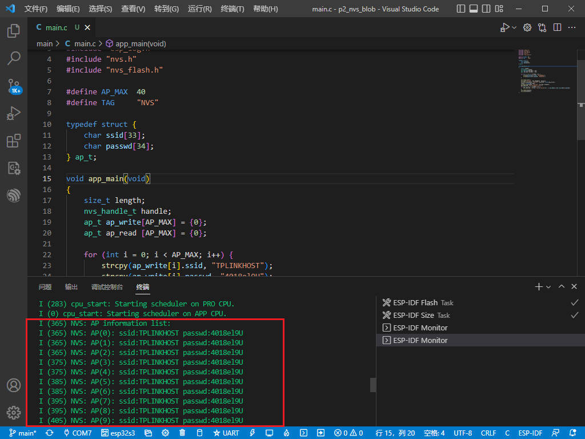
### 4. 启动流程
启动流程：
1. 概述
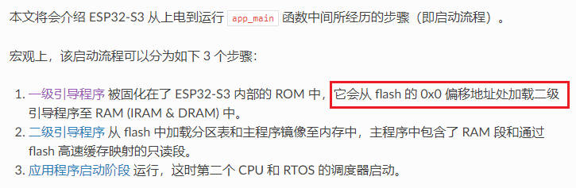
2. bootloader启动
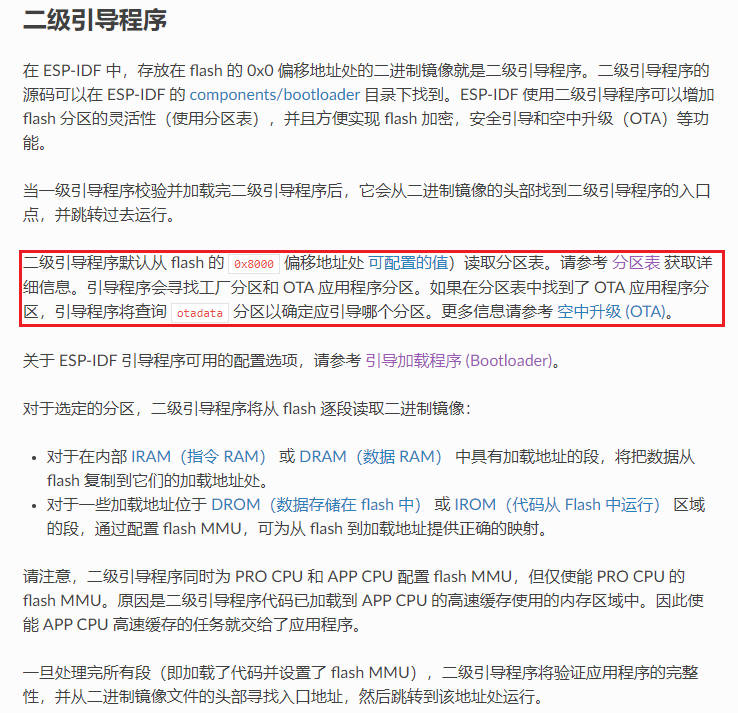
3. APP启动


### 4. PartitionTable分区表
默认的PartitionTable分区表 **（注意！！！ESP32和ESP32S3的Flash布局不同）**
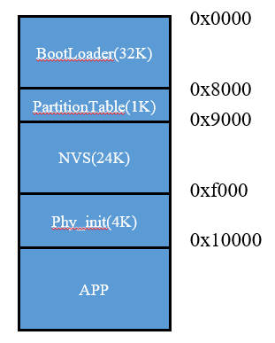
分区表描述
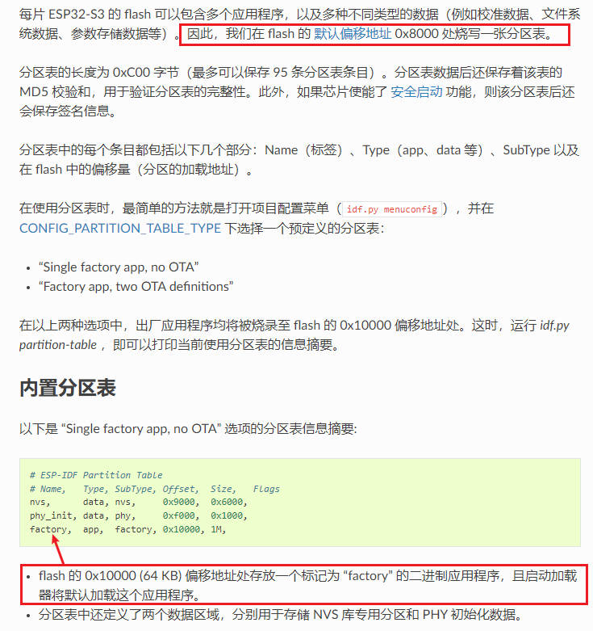
如何自定义分区表？
1. 复制原始分区表到工程路径下
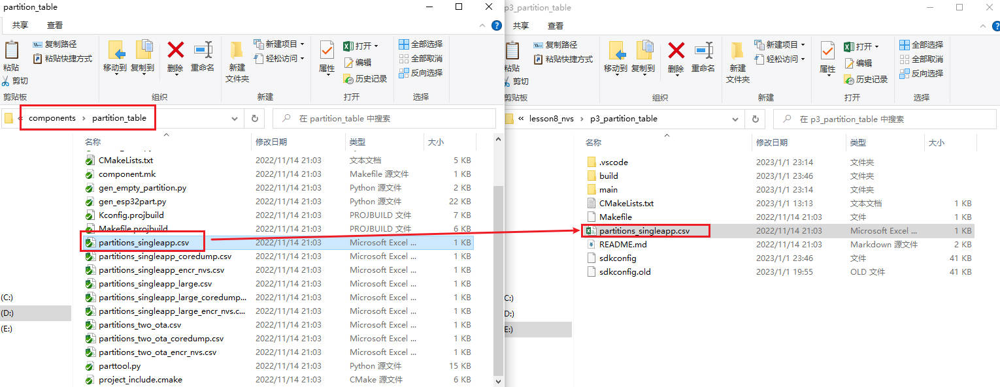
2. 默认分区表内容
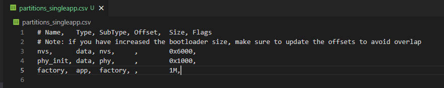
3. 新增一个NVS分区
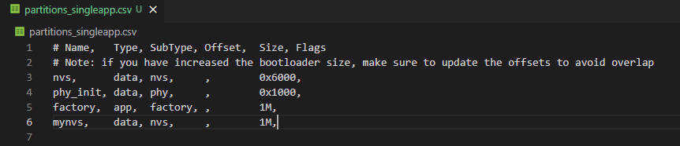
4. 重命名分区表文件
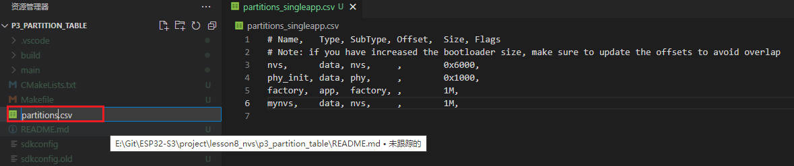
5. menuconfig中输入partition，配置分区表
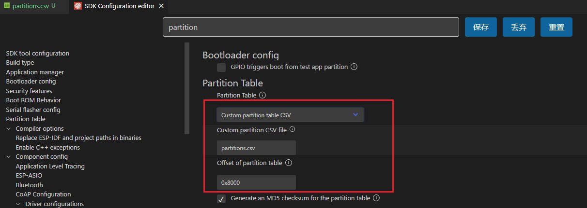
6. 编译工程，可以看到编译报错，原因是Flash不够
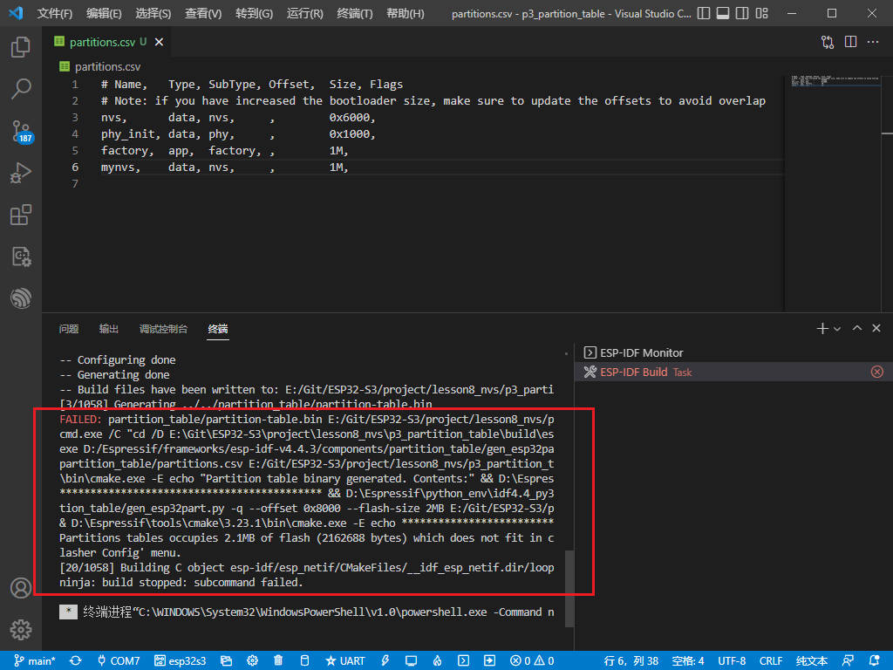
7. 打开menuconfig，输入flash，设置flash大小为8M
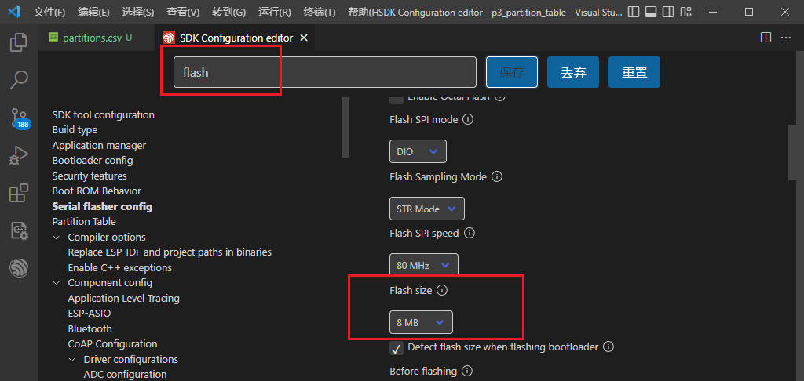
### 5. 使用自定义的分区表
```c
#include <stdio.h>
#include <string.h>
#include "esp_log.h"
#include "nvs.h"
#include "nvs_flash.h"

#define AP_MAX  2
#define TAG     "NVS"

typedef struct {
    char ssid[33];
    char passwd[64];
} ap_t;

void app_main(void)
{
    size_t length;
    nvs_handle_t handle;
    ap_t ap_write[AP_MAX] = {0};
    ap_t ap_read [AP_MAX] = {0};

    for (int i = 0; i < AP_MAX; i++) {
        strcpy(ap_write[i].ssid, "TPLINKHOST");
        strcpy(ap_write[i].passwd, "123456789");
    }

    nvs_flash_init_partition("mynvs");
    nvs_open_from_partition("mynvs", "storage", NVS_READWRITE, &handle);
    nvs_set_blob(handle, "ap_info", ap_write, sizeof(ap_write));
    length = sizeof(ap_read);
    nvs_get_blob(handle, "ap_info", ap_read, &length);
    ESP_LOGI(TAG, "AP information list:");
    for (int i = 0; i < AP_MAX; i++) {
        ESP_LOGI(TAG, "AP(%d): ssid:%s passwd:%s", i, ap_read[i].ssid, ap_read[i].passwd);
    }
    nvs_commit(handle);
    nvs_close(handle);
}
```
原来`nvs_flash_init`改为`nvs_flash_init_partition`, `nvs_open`改为`nvs_open_from_partition`, 这样就从默认的NVS分区，切换到我们自定义的mynvs分区。
**执行结果**
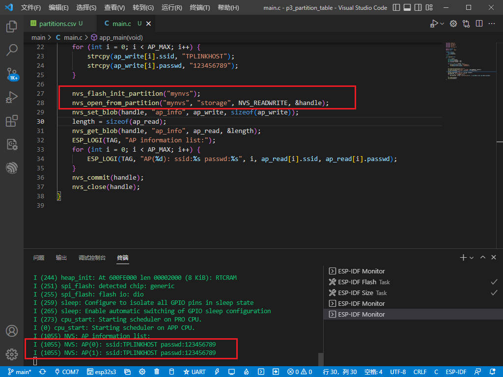