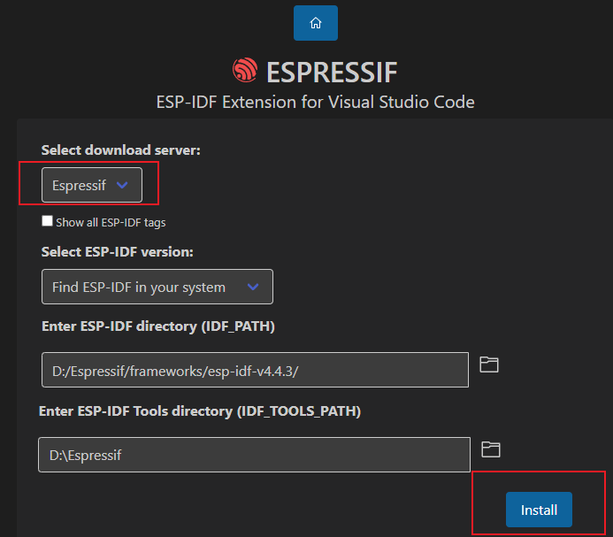
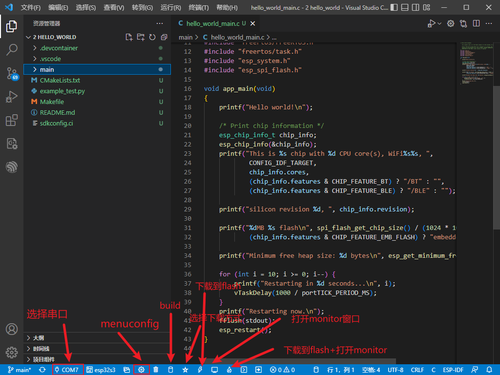
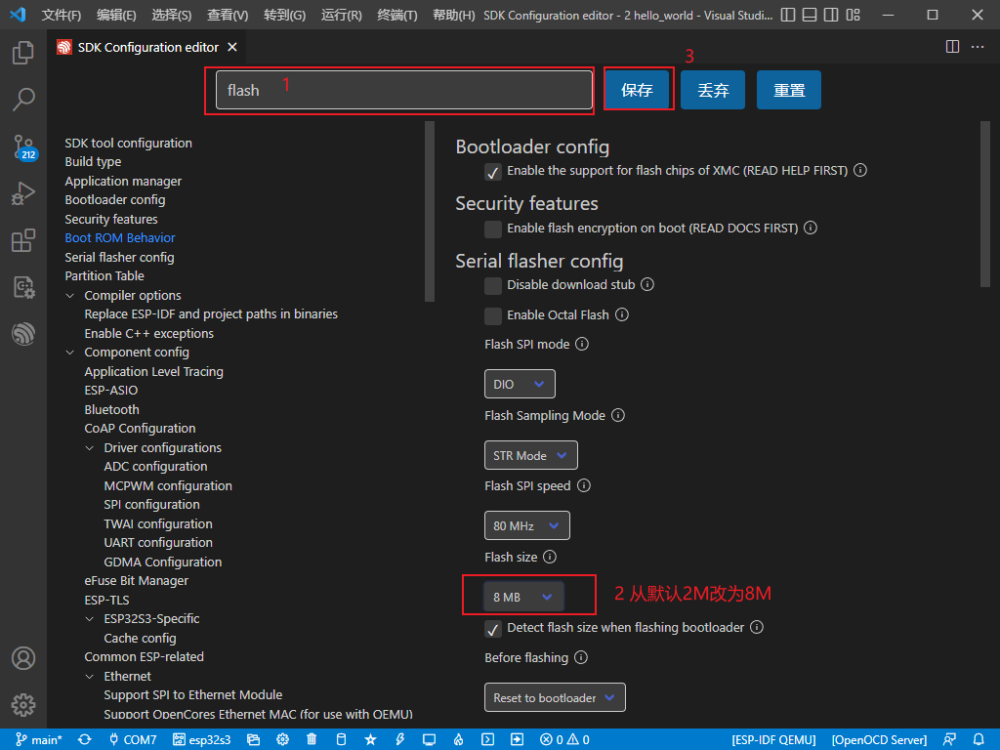

# ESP32-VSCODE环境搭建  
## 环境安装  
1. 在Windows中安装ESP-IDF
2. 在vscode中安装Espressif IDF插件
3. 开始配置Espressif IDF插件
    在vscode最上方点击：查看->命令面板，输入esp-idf:config，选择ESP-IDF:Configure ESP-IDF extension
      
4. 选择EXPRESS
      
5. Select download server选择乐鑫的Espressif，不要选github，这样比较快，然后install，等待安装完成
        

## 新建工程  
#### 方式1：直接复制examples  
1. 从examples中复制demo到文件夹
      
    再使用vscode打开
      
2. 在vscode最上方点击：查看->命令面板，输入esp-idf:vscode，选择ESP-IDF:Add vscode configuration folder
      
    重新加载使配置生效
3. 设置串口和esp-target
      
###方式2：使用vscode创建工程
1. 在vscode最上方点击：查看->命令面板，输入esp-idf:new project
      
2. 设置工程名和路径，选择芯片和串口，创建工程
      
3. 选择ESP-IDF，选择工程模板，再创建工程
      

## 编译工程  
1. Espressif-vscode简介
      
2. 选择menuconfig，配置flash大小（我的板子是ESP32SC-N8R8，8M Flash）
      
3. 编译输出，按Ctrl + ] 可以结束打印
      
