# WIFI扫描  
[乐鑫官网WIFI文档链接](https://docs.espressif.com/projects/esp-idf/zh_CN/v4.4.3/esp32s3/api-guides/wifi.html)   
## 1. ESP32 STA模式启动流程  
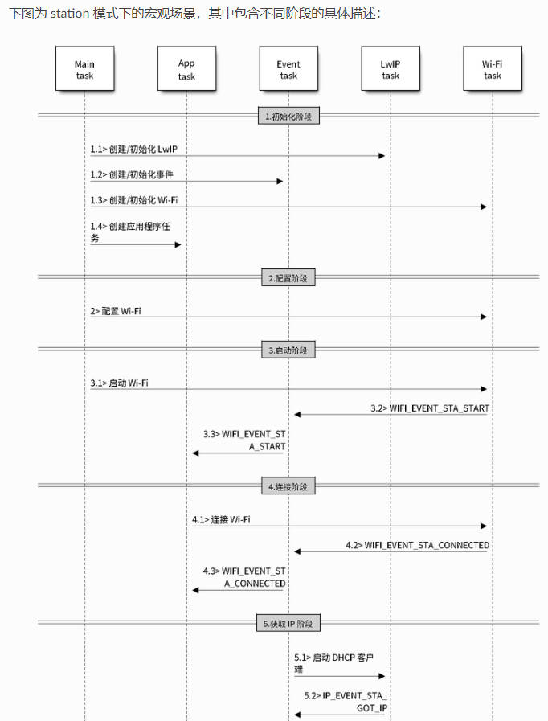   
### 1. 任务说明  
1. MainTask: esp-idf框架的入口，app_main函数  
2. AppTask:  上层应用程序，主要用来跑WIFI业务。这个任务不是必需的，也可以只在MainTask中完成  
3. EventTask: 处理各种WIFI和网络事件  
4. LwIPTask: LwIP协议栈，主要用来做socket通信  
5. WiFiTask: 乐鑫自己做的WiFi库，用于实现WiFi功能  
#### 2. 初始化阶段  
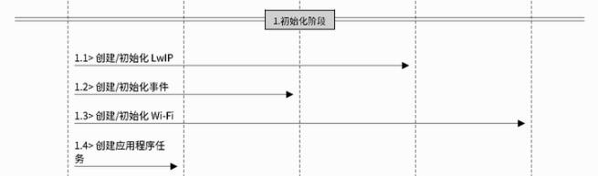   
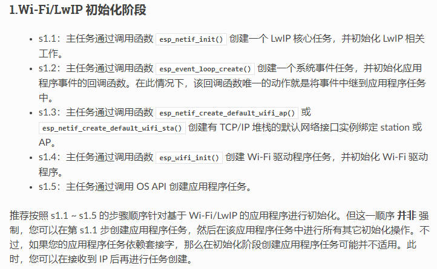   
```c
ESP_LOGI(TAG, "1. WiFi初始化阶段");
esp_netif_init();
esp_event_loop_create_default();
esp_netif_create_default_wifi_sta();
wifi_init_config_t wifi_config = WIFI_INIT_CONFIG_DEFAULT();
esp_wifi_init(&wifi_config);
```
#### 2. 配置阶段   
**注意: 由于WIFI配置信息是保存在NVS中，所以在初始化WIFI之前就要初始化NVS存储**  
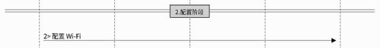   
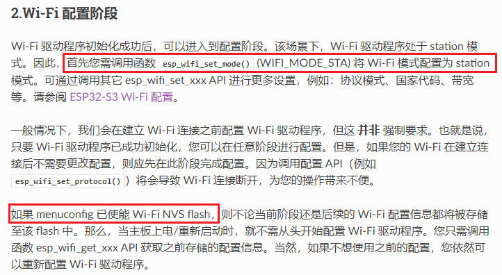   
```c
ESP_LOGI(TAG, "2. WiFi配置阶段");
esp_wifi_set_mode(WIFI_MODE_STA);
```
#### 3. 启动阶段  
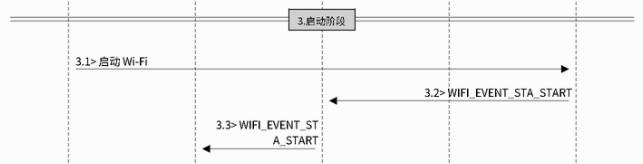   
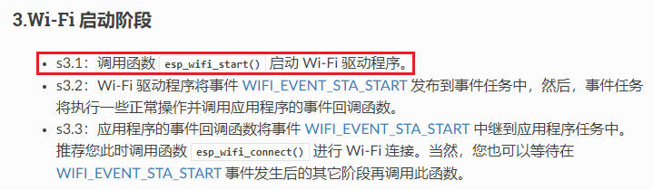   
```c
ESP_LOGI(TAG, "3. WiFi启动阶段");
esp_wifi_start();
```
#### 4. WIFI扫描  
**扫描类型**  
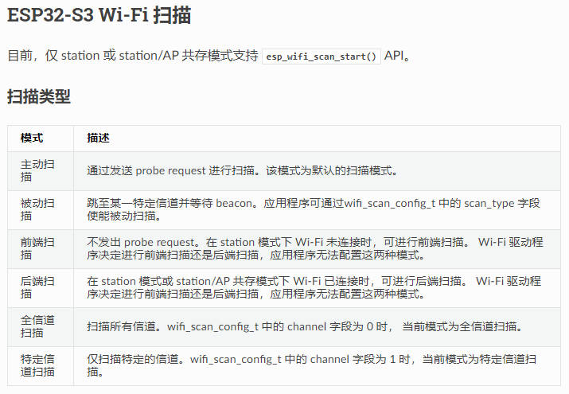    
**扫描流程图**  
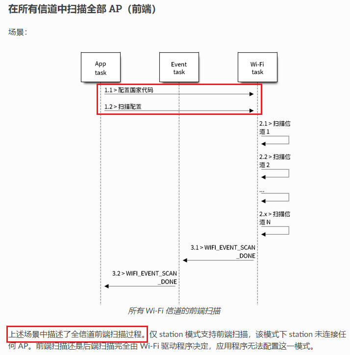    
**扫描接口**  
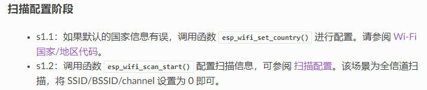    
```c
ESP_LOGI(TAG, "4. WiFi扫描阶段");
wifi_country_t ccode_config = {
    .cc = "CN",
    .schan = 1,
    .nchan = 13,
    .policy = WIFI_COUNTRY_POLICY_AUTO,
};
printf("WiFi scan start...\n");
esp_wifi_set_country(&ccode_config);
esp_wifi_scan_start(NULL, true);
```
**获取扫描结果**  
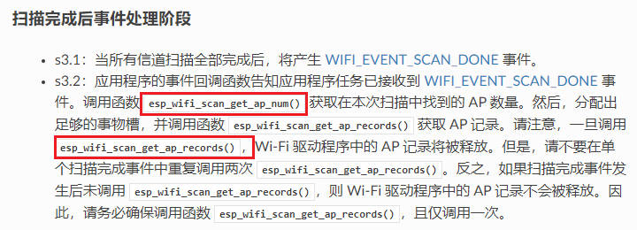   
```c
uint16_t ap_count = 0;
esp_wifi_scan_get_ap_num(&ap_count);
uint16_t number = MAX_SCAN_NUM;
wifi_ap_record_t ap_records[MAX_SCAN_NUM];
memset(ap_records, 0x00, sizeof(ap_records));
esp_wifi_scan_get_ap_records(&number, ap_records);
    printf("%-5s %-30s %-10s %-5s %-5s\n", "seq", "ssid", "channel", "rssi", "mac");
for (int i = 0; i < number; i++) {
    printf("%-5d %-30s %-10d %-5d %02x:%02x:%02x:%02x:%02x:%02x\n", i, ap_records[i].ssid, ap_records[i].primary, ap_records[i].rssi,
        ap_records[i].bssid[0], ap_records[i].bssid[1], ap_records[i].bssid[2], ap_records[i].bssid[3], ap_records[i].bssid[4], ap_records[i].bssid[5]);
}
printf("WiFi scan done!\n");
```
## 2. 完整代码  
```c
#include <stdio.h>
#include <string.h>
#include "esp_log.h"
#include "nvs.h"
#include "nvs_flash.h"
#include "esp_wifi.h"
#include "esp_event.h"

#define MAX_SCAN_NUM    20

const char *TAG = "WIFI";

void app_main(void)
{
    ESP_LOGI(TAG, "0. 初始化NVS存储");
    nvs_flash_init();

    ESP_LOGI(TAG, "1. WiFi初始化阶段");
    esp_netif_init();
    esp_event_loop_create_default();
    esp_netif_create_default_wifi_sta();
    wifi_init_config_t wifi_config = WIFI_INIT_CONFIG_DEFAULT();
    esp_wifi_init(&wifi_config);

    ESP_LOGI(TAG, "2. WiFi配置阶段");
    esp_wifi_set_mode(WIFI_MODE_STA);
    

    ESP_LOGI(TAG, "3. WiFi启动阶段");
    esp_wifi_start();

    ESP_LOGI(TAG, "4. WiFi扫描阶段");
    wifi_country_t ccode_config = {
        .cc = "CN",
        .schan = 1,
        .nchan = 13,
        .policy = WIFI_COUNTRY_POLICY_AUTO,
    };
    printf("WiFi scan start...\n");
    esp_wifi_set_country(&ccode_config);
    esp_wifi_scan_start(NULL, true);

    uint16_t ap_count = 0;
    esp_wifi_scan_get_ap_num(&ap_count);
    uint16_t number = MAX_SCAN_NUM;
    wifi_ap_record_t ap_records[MAX_SCAN_NUM];
    memset(ap_records, 0x00, sizeof(ap_records));
    esp_wifi_scan_get_ap_records(&number, ap_records);
        printf("%-5s %-30s %-10s %-5s %-5s\n", "seq", "ssid", "channel", "rssi", "mac");
    for (int i = 0; i < number; i++) {
        printf("%-5d %-30s %-10d %-5d %02x:%02x:%02x:%02x:%02x:%02x\n", i, ap_records[i].ssid, ap_records[i].primary, ap_records[i].rssi,
            ap_records[i].bssid[0], ap_records[i].bssid[1], ap_records[i].bssid[2], ap_records[i].bssid[3], ap_records[i].bssid[4], ap_records[i].bssid[5]);
    }
    printf("WiFi scan done!\n");
}
```
## 3. 测试结果  
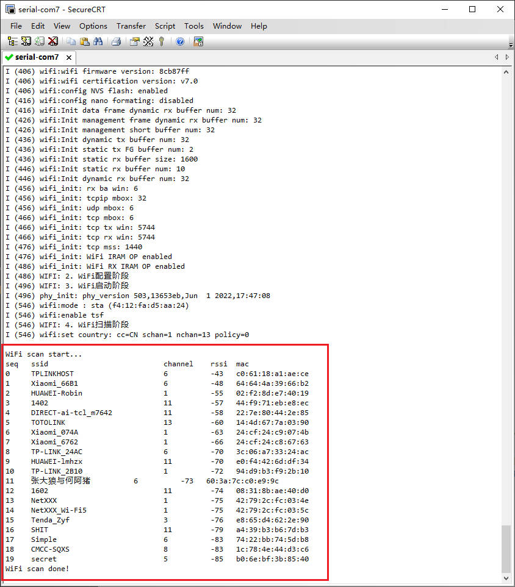   
